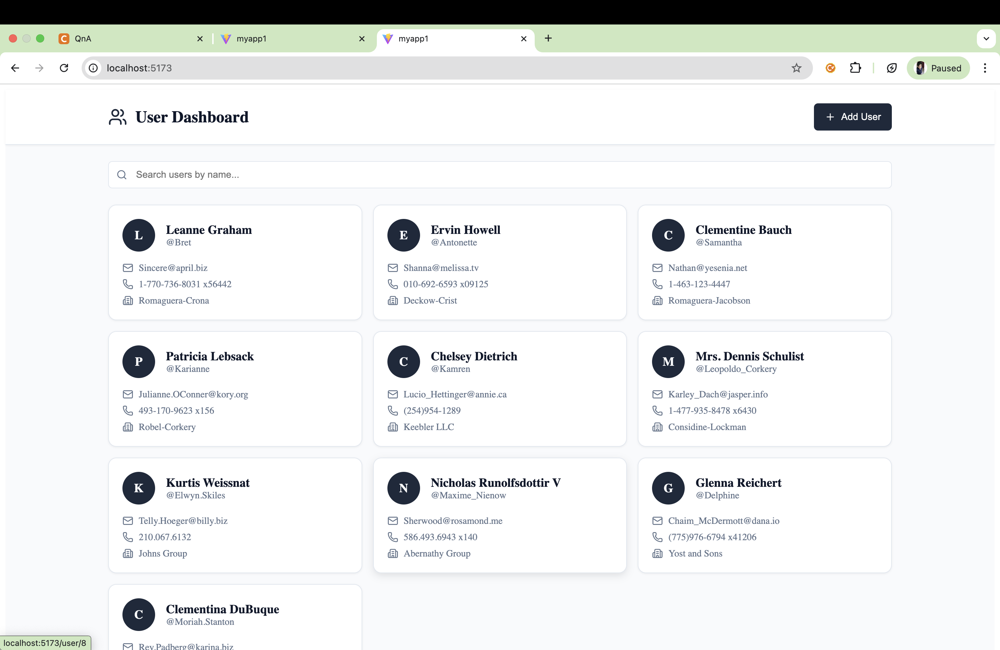
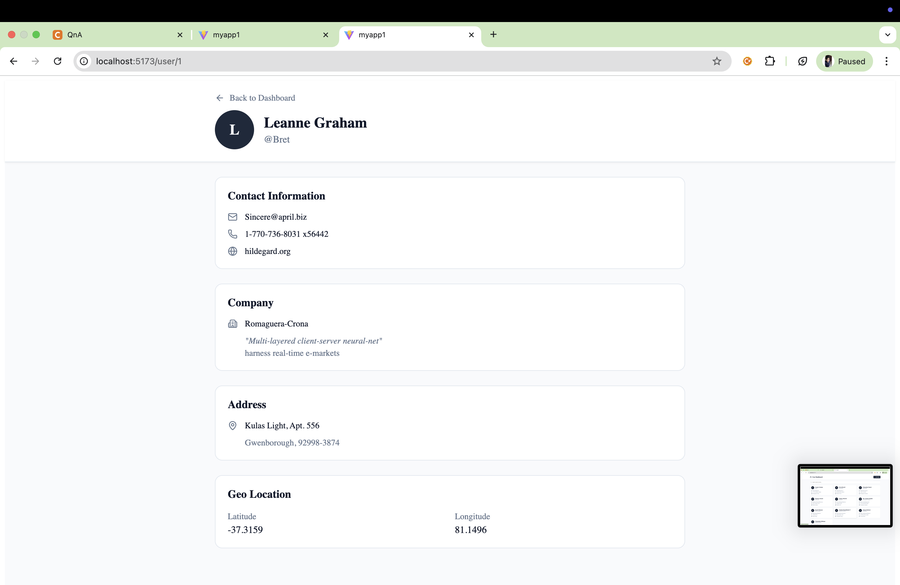

User Dashboard - React Frontend Application

A responsive user management dashboard built with React.js that allows users to view, search, and add new users.

📸 Screenshots

Dashboard Page

User Details Page

🚀 Features

- **User Dashboard**: Display list of users in a card layout
- **Search Functionality**: Filter users by name in real-time
- **Add New User**: Create new users with a client-side form
- **User Details**: View detailed information including contact, company, and address
- **Responsive Design**: Mobile-friendly interface
- **React Context API**: Global state management without prop drilling

🛠️ Tech Stack

- React.js- Frontend library
- React Router DOM - Navigation and routing
- Context API - State management
- Fetch API - Data fetching
- CSS - Styling (mention which one you used)

🎯 Component Overview

 1. UserContext.jsx (Context API)
- Fetches users from `https://jsonplaceholder.typicode.com/users`
- Manages global user state
- Provides `addUser` function to add new users
- Eliminates prop drilling across components

2. index.jsx (Dashboard Page)
- Displays all users in a grid layout
- Implements search/filter functionality
- "Add User" button to create new users
- Uses UserContext to access user data

3. UserDetails.jsx (User Details Page)
- Shows complete user information
- Displays contact details, company info, address, and geo-location
- "Back to Dashboard" navigation

4. UserCard.jsx (Component)
- Reusable card component for each user
- Displays user avatar, name, email, phone, and company
- Clickable to navigate to user details page

⚙️ Installation & Setup

Prerequisites
- Node.js (v14 or higher)
- npm or yarn

Steps to Run Locally

1. Clone the repository
   git clone https://github.com/your-username/user-dashboard.git
   cd user-dashboard

2. Install dependencies
   npm install

3. Start the development server**

   npm run dev

4. Open in browser**
   Navigate to http://localhost:5173

📦 Dependencies
json
{
  "react": "^18.x.x",
  "react-dom": "^18.x.x",
  "react-router-dom": "^6.x.x",
  "axios": "^1.x.x"
}

🎨 Features Implementation

Context API Usage
The application uses React Context API to manage user state globally:
- Provider: Wraps the entire app to provide user data
- Consumer: Components access user data without prop drilling
- Add User: New users are added to the context state dynamically

Routing Structure

/ (Dashboard)           → List of all users
/user/:id (Details)     → Individual user details page

API Integration
- Endpoint: `https://jsonplaceholder.typicode.com/users`
- Methods: GET request to fetch users
- Client-side: New users added locally (no backend POST)

📱 Responsive Design

The application is fully responsive and works seamlessly on:
- Desktop (1024px and above)
- Tablet (768px - 1023px)
- Mobile (below 768px)

🔍 Key Functionalities

1. Search/Filter: Real-time filtering of users by name
2. User Cards: Clean card layout with essential user information
3. Detailed View: Complete user information on separate page
4. Add User Form: Client-side form to create new users
5. Navigation: Smooth routing between pages

📝 Evaluation Criteria Met

Code structure and modularity  
Usage of React hooks (useState, useEffect, useContext)  
Routing implementation with React Router  
Styling and responsiveness  
Git commit history and documentation  
